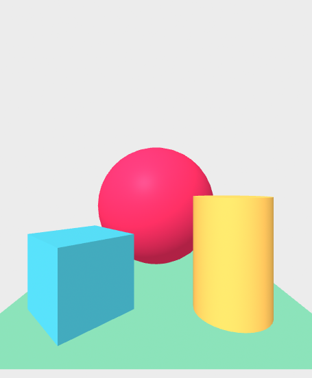
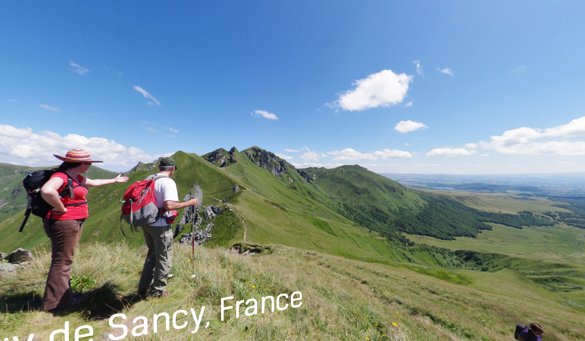
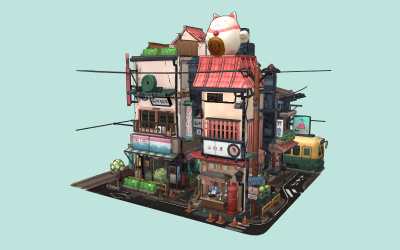

# Entry 1: Deciding on a tool to used for my project.
##### 11/6/23

Context: I decided to have fun and make an Aframe interactive 3D game instead of a vr showcase. My backup tool used to be three.js.org but I decided to use Kaboom.js as a backup instead of three.js.org, because it was not the resource I was looking for. Three.js is used to create and display animated 3D graphics in the browser using WebGL. WebGl is  a JavaScript API for rendering interactive 2D and 3D graphics within any compatible web browser without the use of plug-ins. I tried to use Aframe and three.js. Last week to make sure something happens to the aframe but nothing happened.
<br>
Here are my results for tinkering

```html
<html>
  <head>
    <meta charset="utf-8">
    <meta name="viewport" content="width=device-width">
    <title>JS Bin</title>
    <script src="https://aframe.io/releases/1.4.0/aframe.min.js"></script>
  </head>
<body>
  <a-scene>
      <a-box position="-1 0.5 -3" rotation="0 45 0" color="#4CC3D9"></a-box>
      <a-sphere position="0 1.25 -5" radius="1.25" color="#EF2D5E"></a-sphere>
      <a-cylinder position="1 0.75 -3" radius="0.5" height="1.5" color="#FFC65D"></a-cylinder>
      <a-plane position="0 0 -4" rotation="-90 0 0" width="4" height="4" color="#7BC8A4"></a-plane>
      <a-sky color="#ECECEC"></a-sky>
      <a-entity position="1 2 3"></a-entity>
    </a-scene>
</body>
</html>
```
```js
document.querySelector('a-scene').object3D;
document.querySelector('a-entity').sceneEl.object3D;
console.log(entityEl.object3DMap);
entityEl.getObject3D('mesh');  // THREE.Mesh
entityEl.getObject3D('light');  // THREE.Light
```
As you can see nothing happened. So my main project idea is to create an endless fun 3D game using Aframe that is flappy bird but more challenging where you have to worry about moving pipes and etc, My backup idea for kaboom.js is a challenging platformer game where you have to reach the goal by avoiding traps, bad guys, and cliffs.
<br>
Sources: Some of the sources I discovered while tinkering is <a href="https://threejs.org/">three.js</a>, <a href="https://aframe.io/">Aframe.io</a>, and <a href="https://kaboomjs.com/">kaboom.js</a>. These are the examples of Aframe, Kaboom, and Three.js projects and codes they used.
#### Aframe example:

```html
<!DOCTYPE html>
<html>
  <head>
    <meta charset="utf-8">
    <title>360&deg; Image</title>
    <meta name="description" content="360&deg; Image - A-Frame">
    <script src="../../../dist/aframe-master.js"></script>
  </head>
  <body>
    <a-scene>
      <a-sky src="puydesancy.jpg" rotation="0 -130 0"></a-sky>

      <a-text font="kelsonsans" value="Puy de Sancy, France" width="6" position="-2.5 0.25 -1.5"
              rotation="0 15 0"></a-text>
    </a-scene>
  </body>
</html>
```
#### Kaboom example:


```html
add([
    sprite("bean"),
    pos(80, 40),
    scale(3),
    rotate(30),
    color(0, 0, 255),
])
```


#### Three.js example:

```html
<!DOCTYPE html>
<html lang="en">
	<head>
		<title>three.js webgl - animation - basic</title>
		<meta charset="utf-8">
		<meta name="viewport" content="width=device-width, user-scalable=no, minimum-scale=1.0, maximum-scale=1.0">
		<link type="text/css" rel="stylesheet" href="main.css">
	</head>
	<body>

		<div id="info">
			<a href="https://threejs.org" target="_blank" rel="noopener">three.js</a> webgl - animation - basic use
		</div>

		<script type="importmap">
			{
				"imports": {
					"three": "../build/three.module.js",
					"three/addons/": "./jsm/"
				}
			}
		</script>

		<script type="module">

			import * as THREE from 'three';

			import Stats from 'three/addons/libs/stats.module.js';

			let stats, clock;
			let scene, camera, renderer, mixer;

			init();
			animate();

			function init() {

				scene = new THREE.Scene();

				//

				camera = new THREE.PerspectiveCamera( 40, window.innerWidth / window.innerHeight, 1, 1000 );
				camera.position.set( 25, 25, 50 );
				camera.lookAt( scene.position );

				//

				const axesHelper = new THREE.AxesHelper( 10 );
				scene.add( axesHelper );

				//

				const geometry = new THREE.BoxGeometry( 5, 5, 5 );
				const material = new THREE.MeshBasicMaterial( { color: 0xffffff, transparent: true } );
				const mesh = new THREE.Mesh( geometry, material );
				scene.add( mesh );

				// create a keyframe track (i.e. a timed sequence of keyframes) for each animated property
				// Note: the keyframe track type should correspond to the type of the property being animated

				// POSITION
				const positionKF = new THREE.VectorKeyframeTrack( '.position', [ 0, 1, 2 ], [ 0, 0, 0, 30, 0, 0, 0, 0, 0 ] );

				// SCALE
				const scaleKF = new THREE.VectorKeyframeTrack( '.scale', [ 0, 1, 2 ], [ 1, 1, 1, 2, 2, 2, 1, 1, 1 ] );

				// ROTATION
				// Rotation should be performed using quaternions, using a THREE.QuaternionKeyframeTrack
				// Interpolating Euler angles (.rotation property) can be problematic and is currently not supported

				// set up rotation about x axis
				const xAxis = new THREE.Vector3( 1, 0, 0 );

				const qInitial = new THREE.Quaternion().setFromAxisAngle( xAxis, 0 );
				const qFinal = new THREE.Quaternion().setFromAxisAngle( xAxis, Math.PI );
				const quaternionKF = new THREE.QuaternionKeyframeTrack( '.quaternion', [ 0, 1, 2 ], [ qInitial.x, qInitial.y, qInitial.z, qInitial.w, qFinal.x, qFinal.y, qFinal.z, qFinal.w, qInitial.x, qInitial.y, qInitial.z, qInitial.w ] );

				// COLOR
				const colorKF = new THREE.ColorKeyframeTrack( '.material.color', [ 0, 1, 2 ], [ 1, 0, 0, 0, 1, 0, 0, 0, 1 ], THREE.InterpolateDiscrete );

				// OPACITY
				const opacityKF = new THREE.NumberKeyframeTrack( '.material.opacity', [ 0, 1, 2 ], [ 1, 0, 1 ] );

				// create an animation sequence with the tracks
				// If a negative time value is passed, the duration will be calculated from the times of the passed tracks array
				const clip = new THREE.AnimationClip( 'Action', 3, [ scaleKF, positionKF, quaternionKF, colorKF, opacityKF ] );

				// setup the THREE.AnimationMixer
				mixer = new THREE.AnimationMixer( mesh );

				// create a ClipAction and set it to play
				const clipAction = mixer.clipAction( clip );
				clipAction.play();

				//

				renderer = new THREE.WebGLRenderer( { antialias: true } );
				renderer.setPixelRatio( window.devicePixelRatio );
				renderer.setSize( window.innerWidth, window.innerHeight );
				document.body.appendChild( renderer.domElement );

				//

				stats = new Stats();
				document.body.appendChild( stats.dom );

				//

				clock = new THREE.Clock();

				//

				window.addEventListener( 'resize', onWindowResize );

			}

			function onWindowResize() {

				camera.aspect = window.innerWidth / window.innerHeight;
				camera.updateProjectionMatrix();

				renderer.setSize( window.innerWidth, window.innerHeight );

			}

			function animate() {

				requestAnimationFrame( animate );

				render();

			}

			function render() {

				const delta = clock.getDelta();

				if ( mixer ) {

					mixer.update( delta );

				}

				renderer.render( scene, camera );

				stats.update();

			}

		</script>

	</body>
</html>
```
<br>
Engineering Design Process: I am currently in the second stage of engineering design process where I have to research and plan on what tools I will use for my freedom project. So some of the skills I developed is learning the tool and googling. I learned the tool by reading the instructions, tinkering with the tool on jsbin and looking at examples for Aframe. I also use googling as a skill to look up how to use the codes and all the components that can be used in Aframe to give me a better idea on what my project can be about.

[Next](entry02.md)

[Home](../README.md)