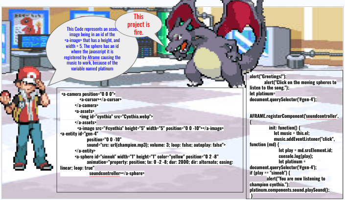

# Entry 6
##### 5/23/24

Context: My next step to create a 3d website that plays music for a frame was to learn how to animate the components I am using. I already learned how to animate the components by knowing how to make them revolve, rotate, and move in different places. Now I took the initiative to learn how to add sounds in the aframe website such as music. Not only that I used javascript to baisically add the if statement that plays music when you click on the spheres.

Content: Some of my takwaways from giving my in-class presentation is to maintain confidence and edit the slides that will keep the viewers attetion to your slide. I also explain the codes I used and made sure I kept the presentation brief. Even when I made a few mistakes like stuttering a bit, or showing some small amount of nervousness, I also gave more eye contact towards my audience and explained my takeaways I learned while making the website. Some of my takeaways for the expo pitch is to be approachable, explain the website you created, and show the viewer on how your website works.

Source: I used my <a href="https://docs.google.com/document/d/1dAbTxmfbOsIWjUminsBh-KFXnfM9Ws49aWmw6HuX68M/edit#heading=h.230gicf5tctj">notes</a> to help me with my expo pitch where I presented to different people, and also used it to make sure I present my <a href="https://docs.google.com/presentation/d/1-TVgyA2QsssZwnzWQiQ2HIsd1ibgx4ngwhaLqMH6c5w/edit#slide=id.p">slides</a> better.

Engineering Design Process: I am currently in the eigth stage of the engineering design process where I evaluate my progress I was given and to see something I can work on next time when I do my expo and presentation. My plan to go to the next stage of engineering design process is to plan how I will fix my past mistakes and to actually practice my presentation so that I could fix things I struggled in such as maintaining eye contact, and using less walls of text to keeps the audience more entertained and less bored. I would also want to do a cooler presentation using Aframe.

Skills: Some of the skills I developed while doing the presentation and expo is creativity where I did something unique with my slides where I had pokemon characters talk and tell you about how I created the website and the challenges I went through creating them.

I also developed skill such as problem decomposition and growth mindset. For problem decomposition, I broke up the challenges I did for my project. For example, I decided to focus on the challenge with the problems of my music and figure out on how to make them play at once. After I did that I used the skill growth mindset by looking at an example of an Aframe <a href="https://www.youtube.com/watch?v=JBtBQQ_mKw4">video</a> to helpe me fix my problem of the components I am using. This helped me come up with the moving spheres in the 
[website](<moving sphere.webm>).

[Previous](entry05.md) | [Next](entry07.md)

[Home](../README.md)